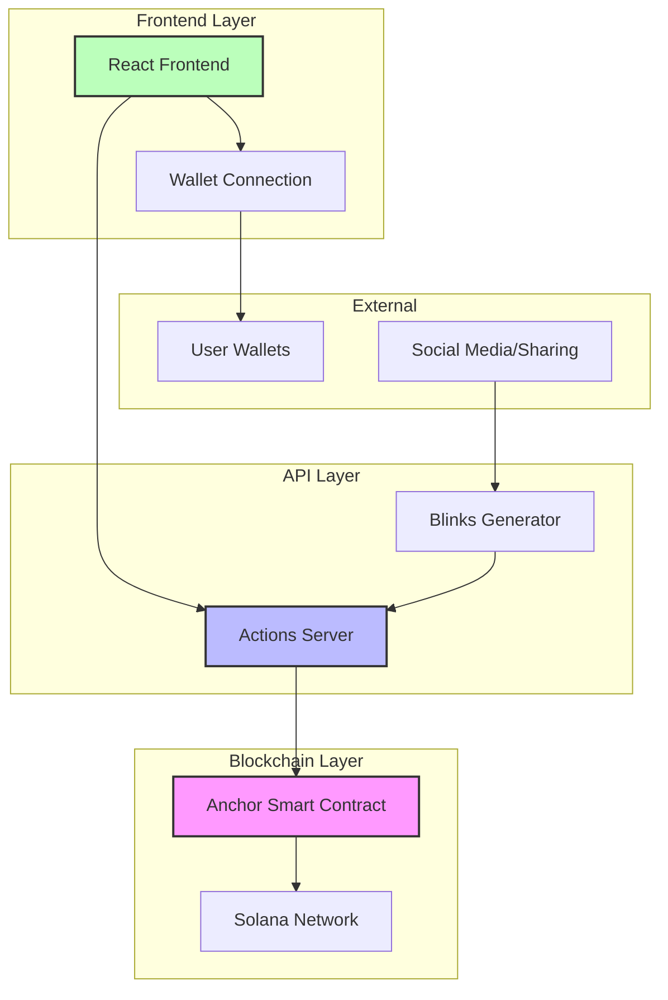

# Design Document

## Overview

The Solana Todo App is a decentralized task management application that demonstrates the integration of Solana blockchain technology with modern web development practices. The system consists of four main components: an Anchor-based smart contract for on-chain data storage, a Solana Actions API server for standardized blockchain interactions, a Blinks generation system for shareable interactive links, and a React-based frontend for user interaction.

The architecture follows a layered approach where the smart contract serves as the data layer, Actions provide the API layer, Blinks enable social sharing capabilities, and the frontend delivers the user experience layer.

## Architecture



## Components and Interfaces

### 1. Anchor Smart Contract (`programs/todo-app`)

**Core Data Structures:**
- `TodoAccount`: Stores individual todo items with metadata
- `UserAccount`: Manages user-specific todo lists and permissions

**Key Instructions:**
- `initialize_user()`: Creates a new user account for todo management
- `create_todo(text: String)`: Adds a new todo item to user's list
- `update_todo(todo_id: u64, completed: bool)`: Modifies todo completion status
- `delete_todo(todo_id: u64)`: Removes a todo item from the list

**Security Features:**
- Owner-only access controls using Anchor's account validation
- Input sanitization for todo text (max 280 characters)
- Proper account initialization checks

### 2. Actions API Server (`actions-server/`)

**Framework**: Express.js with TypeScript
**Endpoints Following Solana Actions Spec:**

```typescript
// GET /actions.json - Actions manifest
// GET /api/actions/create-todo - Get create todo action metadata
// POST /api/actions/create-todo - Execute create todo transaction
// GET /api/actions/complete-todo/:todoId - Get complete action metadata  
// POST /api/actions/complete-todo/:todoId - Execute complete transaction
// GET /api/actions/delete-todo/:todoId - Get delete action metadata
// POST /api/actions/delete-todo/:todoId - Execute delete transaction
```

**Response Format:**
All endpoints return standardized Solana Actions responses with transaction data, metadata, and error handling.

### 3. Blinks Integration

**Generation Logic:**
- Dynamic URL creation: `https://yourdomain.com/blink/action-type/parameters`
- Embedded metadata for social media previews
- Action-specific parameters encoded in URL structure

**Supported Blink Types:**
- Quick Add Todo: `https://app.com/blink/add-todo?user=<pubkey>`
- Complete Specific Todo: `https://app.com/blink/complete/<todoId>?user=<pubkey>`
- View Todo List: `https://app.com/blink/view-todos?user=<pubkey>`

### 4. React Frontend (`frontend/`)

**Technology Stack:**
- React 18 with TypeScript
- Solana Web3.js for blockchain interaction
- Wallet Adapter for multi-wallet support
- TailwindCSS for styling

**Key Components:**
- `TodoList`: Displays user's todos with real-time updates
- `TodoItem`: Individual todo with inline editing and actions
- `WalletConnection`: Handles wallet integration and user authentication
- `BlinkGenerator`: Creates shareable links for todos
- `ActionExecutor`: Processes Actions API calls from the frontend

## Data Models

### Smart Contract Data Models

```rust
#[account]
pub struct UserAccount {
    pub owner: Pubkey,
    pub todo_count: u64,
    pub created_at: i64,
}

#[account]
pub struct TodoAccount {
    pub owner: Pubkey,
    pub id: u64,
    pub text: String,
    pub completed: bool,
    pub created_at: i64,
    pub updated_at: i64,
}
```

### Frontend Data Models

```typescript
interface Todo {
  id: string;
  text: string;
  completed: boolean;
  createdAt: Date;
  updatedAt: Date;
  owner: string;
}

interface ActionResponse {
  transaction: string;
  message: string;
  links?: {
    next: ActionGetResponse;
  };
}
```

## Error Handling

### Smart Contract Error Handling
- Custom error codes for different failure scenarios
- Proper account validation with descriptive error messages
- Input validation with size and format constraints

### Actions API Error Handling
- Standardized HTTP status codes (400, 404, 500)
- Solana Actions compliant error responses
- Transaction simulation before execution
- Retry logic for network failures

### Frontend Error Handling
- User-friendly error messages for blockchain failures
- Loading states during transaction processing
- Fallback UI for wallet connection issues
- Toast notifications for operation feedback

## Testing Strategy

### Smart Contract Testing
- Unit tests for each instruction using Anchor's testing framework
- Integration tests simulating real user workflows
- Security tests for access control validation
- Performance tests for transaction cost optimization

### Actions API Testing
- Endpoint testing with Jest and Supertest
- Mock Solana network for isolated testing
- Actions specification compliance validation
- Load testing for concurrent user scenarios

### Frontend Testing
- Component testing with React Testing Library
- Integration testing with mock wallet adapters
- E2E testing with Playwright for complete user flows
- Accessibility testing for WCAG compliance

### Cross-Component Integration Testing
- End-to-end workflows from frontend through to blockchain
- Blinks functionality testing across different platforms
- Actions API integration with various wallet types
- Real network testing on Solana devnet before mainnet deployment